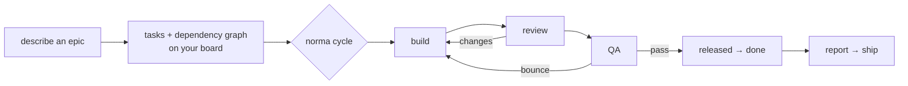

# Norma

**Describe a piece of work. Norma breaks it into tasks, runs AI agents through your
team's real workflow — build → review → QA → done — and moves the cards on your own board.**

## What it solves

AI coding agents are great at *one task*. They're unreliable at *orchestration*: which
task is next, what's blocked, when something is ready for review, when it's truly done.
Norma splits those jobs. A **pure, tested engine** decides orchestration; the **LLM only
does the creative work of one task at a time**. Your issue tracker (Linear, Jira, GitHub)
stays the source of truth, so you watch the whole thing happen on the board you already use.



The engine enforces the dependency graph, the "one task in flight per lane" rule, and the
QA gates — the same way every run. → [why deterministic](docs/WHY-DETERMINISTIC.md)

## Example

No credentials, no setup — run the whole loop against an in-memory board:

```bash
npm i -g @norma-team/cli
norma demo
```

```text
promote DEMO-1 → ready
dispatch DEMO-1 → api-engineer
review DEMO-1
qa qa-batch:1 (1 tasks)
…
epic complete — all tasks released
```

Then point it at your real tracker:

```bash
export LINEAR_API_KEY=lin_api_xxx            # or Jira / GitHub credentials
cd your-project
norma init                                   # reads your board, maps columns, writes config
norma epic --brief "Add referral tiers to the product"   # → tasks + graph on your board
norma cycle <projectId> --slug referral-tiers            # advance the epic
norma serve <projectId>                      # watch it move, live
```

## Install

```bash
npm i -g @norma-team/cli        # provides the `norma` command
```

Requires **Node 20+**. Full requirements, per-tracker credential setup, and troubleshooting:
→ **[Installation guide](docs/INSTALLATION.md)**.

## Documentation

| Doc | What's inside |
|---|---|
| **[Installation](docs/INSTALLATION.md)** | Requirements, install methods, credentials per tracker, verification. |
| **[Getting started](docs/GETTING-STARTED.md)** | Install → init → epic → cycle → ship, end to end. |
| [Architecture](docs/ARCHITECTURE.md) | The engine, the phase model, packages, ports & adapters. |
| [Why deterministic](docs/WHY-DETERMINISTIC.md) | Why a pure engine drives orchestration and the LLM doesn't. |
| [Model selection](docs/MODELS.md) | Norma selects the model; the runtime accesses it. |
| [Agile mapping](docs/AGILE-MAPPING.md) | The engineering-squad mental model. |
| [Positioning](docs/POSITIONING.md) | What Norma is — and isn't. |
| [Validation](docs/VALIDATION.md) | Live-API status per adapter. |

Full index: [docs/](docs/README.md).

## Works with your stack

- **Trackers:** Linear · Jira · GitHub Issues · in-memory (offline). Adding one is an
  adapter + a mapping — no engine change.
- **Agent runtimes:** Claude Code · OpenCode (multi-provider) · any command/script ·
  humans (review/QA by comment) · echo (offline). Norma *selects* the model; the runtime
  *accesses* it → [model selection](docs/MODELS.md).
- **Pipelines:** ships a `software-dev` preset (and `content`, `github`); write your own
  as config.

## Status

Published to npm as `@norma-team/cli`. 14 packages, ~84 tests, CI green. **GitHub, Linear,
and Jira are validated end-to-end against live APIs** (see [validation](docs/VALIDATION.md)).
