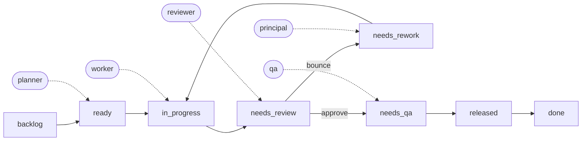

# The mental model: an engineering squad

Norma is not an abstract graph executor that happens to call LLMs. It is modeled on a
concrete, well-understood thing: **an engineering squad delivering work off a board.**

That is why its mechanics feel familiar — they are the same mechanics a good agile/Kanban
team already uses. The difference is that in Norma the **working agreement is executable
code** (`computePlan`) instead of a convention people try to remember. The team's process
becomes a pure, deterministic function; the agents are the squad members playing fixed
roles.

This framing is deliberate, and it is where the [deterministic
orchestrator](WHY-DETERMINISTIC.md) earns its keep: a team's process *is* a set of known
rules. Encoding those rules is natural — you are not inventing policy, you are automating
the one your squad already follows.

## The squad at a glance

The picture is the fastest way to internalize it: a task flows across the board, and at
each stage a fixed role does its part — just like a real squad pulling work through
columns.

Solid arrows are the board's phase transitions; dashed arrows show which role acts at
each stage. The `principal` only steps in on escalation — after N bounces, the rework
loop stops and a lead is raised.

## The squad → Norma mapping

| Engineering squad / Agile–Kanban | Norma equivalent |
|---|---|
| Cross-functional team with **fixed roles** (dev, reviewer, QA) | Agents with fixed roles (`planner`, `worker`, `reviewer`, `qa`) — the agent catalog |
| **Board columns** / workflow states | Canonical **phases**: `backlog → ready → in_progress → needs_review → needs_qa → released → done` |
| **WIP limit** (limit work in progress) | The **one-in-flight gate** — at most N tasks in progress per lane |
| **Pull system** (pull work when there's capacity) | The engine only dispatches when a slot frees up; nothing is pushed |
| Story **breakdown & dependencies** | The **dependency DAG** — a task becomes `ready` only when its deps are `released` |
| **Definition of Ready** | `backlog → ready` promotion rule |
| **Code review** / PR approval | `needs_review`; a bounce sends the task back → `needs_rework` |
| **Rework** on review/QA rejection | The **rework loop**; re-dispatch to a worker |
| **Blocked → escalate** to a lead | **Escalate at N** — after N bounces, stop looping and raise it |
| **QA / test column**, often batched per release | **QA per batch** — a batch is gated until its members are ready |
| **Definition of Done** | `released → done` (via `complete`) after report/ship |
| **Standup / re-planning** | Each `norma cycle`: read the board, re-plan to a fixed point, write back |
| The team's **working agreement** (the process everyone follows) | `computePlan` — the process as pure, testable code |

## The WIP limit, specifically

The single most recognizable borrowing is the **WIP limit** — the core discipline of
Kanban.

A squad limits work-in-progress because piling on parallel work destroys throughput:
context-switching, half-finished tasks, review pileups, and integration conflicts. The
team agrees to a cap and **pulls** the next item only when a slot opens.

Norma enforces exactly this as the **one-in-flight gate**: the engine will not dispatch a
new task into a lane while that lane is at its limit. It is not advisory — it is a hard
invariant of `computePlan`. Same reasoning as the human team (protect throughput, avoid
half-done pileups), except it can never be "just this once" violated under deadline
pressure, because a rule in code has no deadline pressure.

This is also why parallelism in Norma looks different from a fleet cockpit like Orca:
Orca runs **many agents on the same task** so a human can compare; Norma runs agents on
**different tasks across the DAG**, bounded by the WIP limit — exactly how a squad
parallelizes across a board.

## A concrete walk-through

Say the board holds three tasks: `A` (add an endpoint), `B` (write its client), and
`C` (docs), where `B` depends on `A`. With a WIP limit of 1 per lane, a cycle plays out
like a squad would run it:

- `A` and `C` are `ready` (no deps); `B` waits — its dep `A` is not `released` yet.
- The engine pulls `A` into `in_progress` (a `worker` picks it up). The lane is now full,
  so `C` stays put — the WIP gate holds.
- `A` finishes → `needs_review`. The `reviewer` bounces it once → `needs_rework`, a
  `worker` fixes it, and on the second pass it is approved → `needs_qa` → `released`.
- `A` being `released` promotes `B` to `ready`. Next cycle the engine pulls `B` (and `C`,
  in its own lane) forward — no standup required, the board *is* the status.

## What Norma keeps from agile — and what it drops

**Keeps** (the mechanics that make flow work):
- Fixed roles, board/phases, WIP limit, pull system, dependency ordering, review/QA
  gates, rework loops, escalation, definition of ready/done.

**Drops** (the human-coordination rituals — no people to coordinate):
- Estimation/story points, velocity, standups-as-meetings, retros, sprint ceremonies.
  The engine re-plans every cycle for free, so there is no cadence to schedule and no
  status meeting to hold — the board *is* the status.

## Why this analogy matters

Two payoffs:

1. **It makes the rules obvious.** You are not designing orchestration from scratch; you
   are encoding a process your industry already refined over decades. WIP limits, pull,
   review gates, and DoD are battle-tested — Norma just makes them deterministic and
   unattended.

2. **It reinforces the core thesis.** A squad's process is a *known, repeated* thing —
   precisely the case where a [deterministic engine](WHY-DETERMINISTIC.md) beats letting
   an LLM re-decide the flow every step. The agile mapping is the strongest evidence that
   the flow *should* be code: teams write these rules down as agreements exactly because
   they are stable and repeatable.
