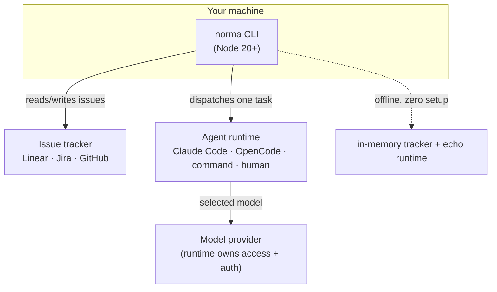

# Installation

This guide takes you from nothing to a working `norma` command connected to your tracker.
It covers **requirements**, **install methods**, **credentials per tracker**, **agent
runtimes**, and **verification**.

## What you need

Norma is an orchestrator. It needs three things around it: a place to run, a tracker to
drive, and a runtime to execute agents.



| Component | Requirement | Needed for |
|---|---|---|
| **Node.js** | **20 or newer** (`node -v`) | running the CLI at all |
| **npm** | bundled with Node | installing the CLI |
| **git** | any recent version | per-epic worktrees, PRs (optional) |
| **Tracker credentials** | API token (see below) | connecting to Linear / Jira / GitHub |
| **Agent runtime** | a CLI like `claude` or `opencode` | running *real* agents (skip for offline demo) |

> You can try Norma with **none** of the tracker/runtime pieces — the `demo` and
> `serve --demo` commands run fully offline against an in-memory board with echo agents.

## Install the CLI

### Recommended — global install from npm

```bash
npm i -g @norma-team/cli
norma --version
```

This is a self-contained binary: the whole engine, adapters, and runtimes are bundled in,
so there are no peer dependencies to manage.

### Alternative — run without installing

```bash
npx @norma-team/cli demo
```

### From source (contributors)

```bash
git clone https://github.com/marceloF5/norma.git
cd norma
pnpm install
pnpm build
pnpm --filter @norma-team/cli exec norma --version
```

## Verify it works (offline, no credentials)

```bash
norma demo          # runs a full build → review → QA → done loop on an in-memory board
```

You should see tasks promoted, dispatched, reviewed, and the epic complete. If that works,
the engine is healthy and you're ready to connect a tracker.

## Connect a tracker

Norma reads credentials from environment variables. Set them in your shell (or a `.env`
you source) before running `norma init`.

### Linear

1. Create a personal API key at **https://linear.app/settings/api**.
2. Export it (and optionally your team key):

```bash
export LINEAR_API_KEY=lin_api_xxxxxxxx
export LINEAR_TEAM=NEX            # your team's key or name (optional; init will ask)
```

Linear can **create the missing board columns and labels for you** during `init`.

### Jira Cloud

Jira uses Basic auth (email + API token) and needs your site URL and a project key:

```bash
export JIRA_BASE_URL=https://your-site.atlassian.net
export JIRA_EMAIL=you@example.com
export JIRA_API_TOKEN=ATATT...          # https://id.atlassian.com/manage-profile/security/api-tokens
export JIRA_PROJECT=SCRUM               # the project key (letters before the issue number)
```

> Jira statuses are **admin-managed** — Norma can't create them via API. `init` will list
> exactly which statuses you need to add to the project's workflow (e.g. `Ready for PR`).

### GitHub Issues

```bash
export GITHUB_TOKEN=ghp_xxxxxxxx        # a token with repo + issues scope
export GITHUB_REPO=owner/repo
```

GitHub Issues has no columns, so Norma models phases with **labels** — `init` provisions them.

## Set up your project

```bash
cd your-project
norma init
```

`init` connects, **reads your real board columns**, lets you map each phase to a column,
picks your worker lanes + agents + runtime, and writes:

- `norma.config.json` — how your board maps to Norma's workflow
- `.norma/agents/*.md` — your agents, as editable Markdown

Non-interactive (CI):

```bash
norma init --yes --tracker linear --team NEX --workers api,web --runtime claude-code
```

Then validate everything:

```bash
norma doctor        # checks config, credentials, board mapping, and agent files
```

## Choose an agent runtime

The runtime is *how* agents execute. Norma only **selects** the model; the runtime owns
model access and auth (→ [model selection](MODELS.md)).

| Runtime | Install | Notes |
|---|---|---|
| `claude-code` | Claude Code CLI (`claude`) | default; `claude -p` per task |
| `opencode` | OpenCode CLI (`opencode`) | multi-provider (`openai/…`, `anthropic/…`, `ollama/…`) |
| `command` | any script you write | universal escape hatch — wrap any CLI |
| `human` | none | a person handles review/QA via tracker comments |
| `echo` | none | offline stub for dry runs |

Set the runtime in `norma.config.json` (or via `norma init --runtime <kind>`). For real
runs, make sure the runtime's CLI is installed and authenticated on your machine.

## Troubleshooting

| Symptom | Fix |
|---|---|
| `norma: command not found` | Ensure your global npm bin is on `PATH` (`npm bin -g`); reopen the shell. |
| `node: unsupported engine` | Upgrade to Node 20+ (`nvm install 20`). |
| `init` can't connect | Check the env vars above are exported **in the same shell**; re-run `norma doctor`. |
| Jira: missing statuses | Add the statuses `init` listed to the project's workflow (admin), then re-run `doctor`. |
| Cards don't move | Run `norma plan <id>` (read-only) to see what the engine would do and why it's blocked. |

## Next

- **[Getting started](GETTING-STARTED.md)** — the full loop: epic → cycle → ship.
- [Architecture](ARCHITECTURE.md) — how the pieces fit.
