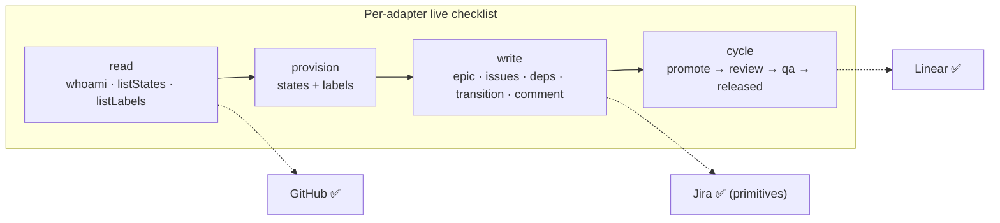

# Live validation

Norma's adapters are unit-tested offline with mocked `fetch` (locking request/response
shapes). This document tracks validation against **live** provider APIs, which requires
real credentials.



## GitHub — full read + write path ✅ (2026-09-11)

Validated end-to-end against the real `marceloF5/norma` repo using the `gh` CLI token:

- **Read:** `whoami`, `listStates`, `listLabels`, `listIssues`, `plan`, `status`.
- **Write:** `norma epic --plan-file` created a milestone + 2 issues (labels + a
  `blocked-by` DAG edge); `norma cycle --runtime echo` drove the whole epic
  promote → dispatch → review → qa → released for both tasks (respecting the DAG),
  ending `complete: true`. Throwaway milestone/issues/label were cleaned up after.

**Bug found & fixed by this run:** on GitHub, phases live in labels (released = open +
`qa-approved`), but the normalizer classified a blocker from its *state* alone — so a
released blocker read as "backlog" and its dependent never unblocked. `RawDependency`
now carries the blocker's `labels`, and the GitHub adapter supplies them
(`normalize` classifies with state + labels). Covered by a regression test.

## Linear — full read + write path ✅ (2026-09-18)

Validated end-to-end against a live Linear workspace (team `NEX`):

- **Read:** `whoami` (identity + team context), `listStates`, `listLabels`, `plan`, `status`.
- **Provision:** `norma init` connected, read the real columns, and **created the missing
  ones** (`In Review`, `Ready for PR`) plus the pipeline labels (`ready-for-dev`,
  `needs-review`, `needs-qa`, `changes-requested`, `qa-approved`). `norma doctor` → all green.
- **Write + cycle:** `norma epic --plan-file` created a project + 2 issues + a dependency;
  `norma cycle` drove the whole epic promote → dispatch → review → qa → **released** for
  both tasks (respecting the DAG), ending `complete: true`.

**Finding:** two *dependent* tasks placed in the **same `qa-batch`** deadlock — the batch
waits for every member to reach `needs_qa`, but the dependent can't get there until the
blocker releases. The cycle stalls silently (`steps: 0`) instead of warning. Fix tracked:
reject same-batch dependencies at plan validation + warn on a no-progress stall.

## Jira Cloud — read + write primitives ✅ (2026-09-18)

Validated against a live Jira Cloud site (project `SCRUM`):

- **Read:** `whoami`, `listStates` (`To Do · In Progress · In Review · Done`), `listLabels`.
- **Setup:** `norma init` connected and — correctly, since Jira statuses are
  admin-managed — **listed the statuses to add manually** (`Backlog`, `Ready for PR`,
  `Canceled`) instead of trying to create them.
- **Write:** `createProject` (Epic issue), `createIssue` (Task with parent + labels),
  `transition` (To Do → In Progress, a real workflow transition), `comment`, and
  `listIssues` reading back the correct state + labels.

The full end-to-end cycle needs the three missing statuses added in the Jira workflow (admin
only) — the adapter mechanics are all proven.

**Finding:** `doctor` flags Jira's free-form labels as hard "problems" even though Jira
creates labels on first use — they should be warnings, not errors.

## Re-run the checklist yourself

```bash
# Linear
export LINEAR_API_KEY=lin_api_xxx
norma whoami
norma plan <projectId>          # read-only
norma cycle <projectId> --dry-run

# Jira Cloud
export JIRA_BASE_URL=https://your-site.atlassian.net JIRA_EMAIL=you@x.com JIRA_API_TOKEN=xxx JIRA_PROJECT=ENG
norma doctor
```

Required scopes: Linear personal API key (issues read/write); Jira API token (browse
projects, edit issues, transition issues); GitHub token with `repo` scope.

## Interactive `norma init` (issue #8)

The non-interactive path (`norma init --yes …`) is verified. The interactive wizard —
column→phase mapping, missing state/label provisioning, agent/runtime selection — needs a
manual run against a real Linear board to confirm end-to-end. Drive `norma init` (no
`--yes`) with `LINEAR_API_KEY` set and confirm the generated `norma.config.json` + agents.
